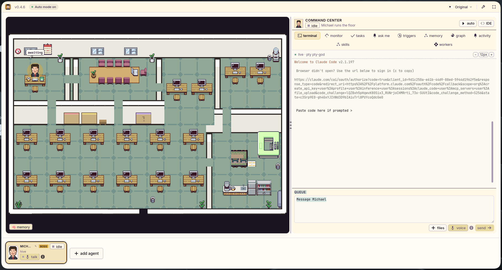
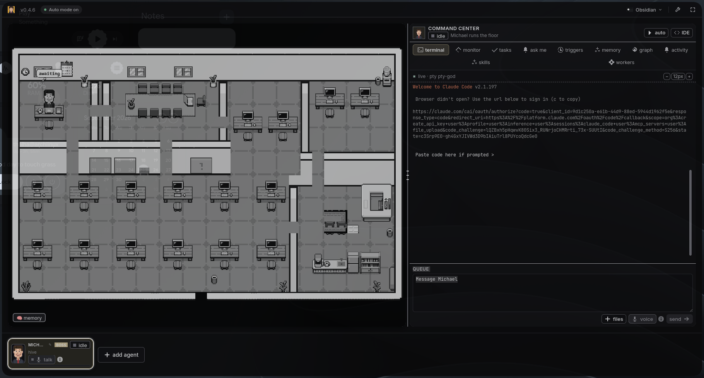
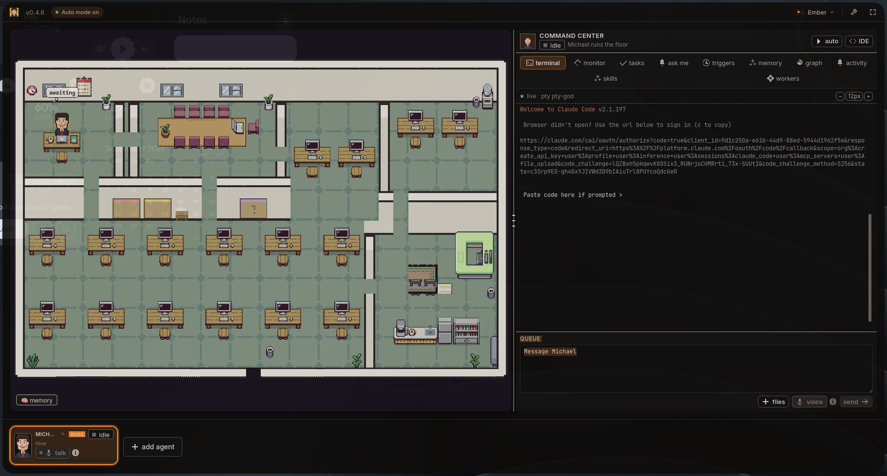
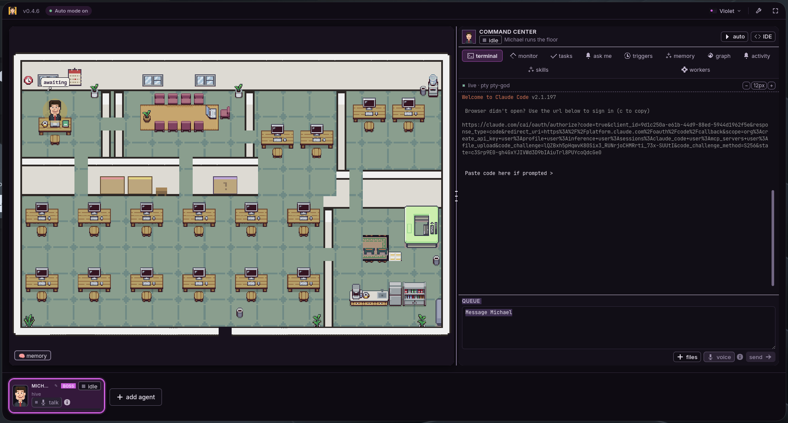
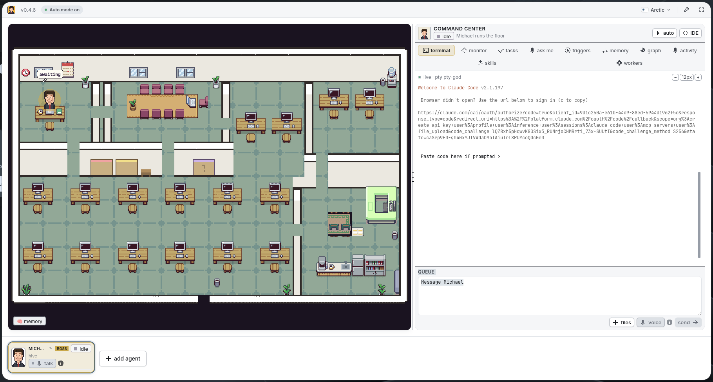

# Munder Difflin

### Agent harness to run an office of your clones

<p align="center">
  
</p>

<p align="center">
  <strong>A themed fork of Munder Difflin with additional visual styles.</strong>
  <br>
  <sub>Same agents. Same office. Same workflows. New looks.</sub>
</p>

<p align="center">
  <a href="#theme-preview">Theme Preview</a> ·
  <a href="#themes">Themes</a> ·
  <a href="#getting-started">Getting Started</a> ·
  <a href="#architecture">Architecture</a>
</p>

---

## ✦ Theme Preview

<p align="center">
  <sub>Explore the different visual styles included with this fork.</sub>
</p>

<table>
  <tr>
    <td align="center" width="33%">
      
      <br>
      <sub><b>Original</b></sub>
    </td>
    <td align="center" width="33%">
      
      <br>
      <sub><b>Obsidian</b></sub>
    </td>
    <td align="center" width="33%">
      
      <br>
      <sub><b>Ember</b></sub>
    </td>
  </tr>
  <tr>
    <td align="center" width="33%">
      
      <br>
      <sub><b>Violet</b></sub>
    </td>
    <td align="center" width="33%">
      
      <br>
      <sub><b>Arctic</b></sub>
    </td>
    <td width="33%"></td>
  </tr>
</table>

---

## 🎨 Themes

This fork adds multiple visual themes to the Munder Difflin interface while keeping the underlying application and agent workflow intact.

| Theme        | Description                                           |
| ------------ | ----------------------------------------------------- |
| **Original** | The classic Munder Difflin appearance                 |
| **Obsidian** | Deep grayscale, dark surfaces and a subdued interface |
| **Ember**    | Dark graphite with bright orange accents              |
| **Violet**   | Purple and magenta focused styling                    |
| **Arctic**   | Bright white and cool-gray styling                    |

### Original

The familiar Munder Difflin experience.

### Obsidian

A darker visual treatment built around deep grayscale surfaces and reduced visual noise.

### Ember

A graphite-based interface with bright orange accents.

### Violet

A purple and magenta visual treatment.

### Arctic

A bright white and cool-gray interface with a clean modern appearance.

---

## 🧩 Theme Patch

This fork includes the theme customization patch:

```text
munder-difflin-color-themes.patch
```

The patch is located at the root of the repository.

To verify the patch before applying it:

```bash
git apply --check munder-difflin-color-themes.patch
```

To apply it:

```bash
git apply munder-difflin-color-themes.patch
```

---

## Munder Difflin

Free, open source and performant — a multi-agent harness that works with the subscriptions you already pay for, on their hourly limits. It turns the terminal coding CLI you already run into a clone of you, one that keeps working while you're away and coordinates a whole office of agents on your own machine.

Wraps Claude Code, Antigravity (Gemini), OpenAI Codex, xAI Grok, Kimi Code, Gemini CLI, Qwen, OpenCode, Crush, pi.dev, GitHub Copilot CLI, and Cursor — with bring-your-own keys and local LLMs.

Agents message, route, and remember, coordinated by your clone (Michael) and visualized as avatars at work on a shared office floor.

**Electron · React · TypeScript · Pixi.js · xterm.js · node-pty**

---

## Contents

* [Supported agents](#supported-agents)
* [What it is](#what-it-is)
* [How it works](#how-it-works)
* [Features](#features)
* [Getting started](#getting-started)
* [Architecture](#architecture)
* [Roadmap](#roadmap)
* [Contributing](#contributing)
* [Telemetry](#telemetry)
* [License](#license)
* [Acknowledgements](#acknowledgements)

---

## Supported agents

Bring the CLI you already pay for.

Every one of these runs as a real process in its own terminal, with your existing subscription and its hourly limits. If it runs in a terminal, it can run here.

`Claude Code` · `Codex · GPT` · `Grok · xAI` · `Kimi Code` · `Gemini CLI` · `Antigravity · Gemini` · `Qwen` · `OpenCode` · `Crush · Charm` · `Pi` · `GitHub Copilot` · `Cursor` · `+ any custom command`

Plus bring your own keys and local models through Ollama, LM Studio or vLLM.

---

## What it is

Munder Difflin is a desktop app that wraps real terminal-agent CLIs as fully-capable agents, wires them into a hive mind, and puts your clone in charge — Michael, the one agent you talk to in order to get things done.

Under the hood it runs the memory layer so every agent can remember what it learns and recall it across sessions.

* **Every terminal is an agent.** Each `claude`, `agy`, `codex`, `grok`, `kimi`, `qwen`, `opencode`, `crush`, `pi`, `copilot`, or custom session runs as a real process in a pseudo-terminal (`node-pty`), rendered with xterm.js.
* **Every agent is an avatar.** Sessions appear as characters on a Pixi.js office floor — they walk to stations as they work, and messages can travel between desks.
* **The hive coordinates them.** Agents read their memory and drain a mailbox; the router moves messages between inboxes; the GOD agent coordinates work and escalates when human input is required.
* **Memory across sessions.** A markdown-first memory layer with semantic recall allows agents to retain useful information across sessions.

---

## How it works

```text
            you ── talk to ──►  ┌─────────────┐
                                 │  GOD agent  │
                                 │  Michael    │
                                 │ orchestrator│
                                 └──────┬──────┘
                                        │
                       assigns · routes · escalates
                                        │
              ┌─────────────────────────┼─────────────────────────┐
              ▼                         ▼                         ▼
        ┌───────────┐            ┌───────────┐            ┌───────────┐
        │  agent A  │  message   │  agent B  │  message   │  agent C  │
        │ provider  │ ─────────► │ provider  │ ─────────► │ provider  │
        │  + memory │            │  + memory │            │  + memory │
        └───────────┘            └───────────┘            └───────────┘
              └──────── shared hive: memory · mailbox · blackboard · log ───────┘
```

1. You spawn agents — each is a normal terminal process with its own working directory, identity, and provider-specific lifecycle.
2. Agents collaborate through the hive — a local git repo of plain files.
3. Agents write to their own `outbox/`; the harness router delivers messages into recipients' `inbox/`.
4. The GOD agent coordinates the floor and escalates critical items when human input is required.
5. Everything is visible — watch avatars move, inspect terminals, browse files, and interact with sessions directly.

See `HIVE.md` for the full multi-agent design, `SPEC.md` for the terminal/event plane, and `DESIGN.md` for the visual system.

---

# Features

### Talk to one agent, not twelve

Michael is your clone and the agent you brief. He assigns work, routes traffic, and escalates tasks that need you.

### Hire an agent in a few clicks

Pick the CLI, model and autonomy, give it a desk, and it starts working.

### Memory that survives the session

Every agent keeps markdown memory that can be mined into a shared searchable memory layer.

### Autonomy with a leash

Set how far each agent may go on its own. Critical actions can return to you for approval.

### Watch the whole floor work

Agents walk to stations as they work and messages travel between desks.

Click any desk to read that terminal live and interact with it directly.

### Set up once

The onboarding wizard checks what you already have and helps identify missing prerequisites.

### The floor

* Every terminal is a real agent.
* Every agent is an avatar.
* A GOD orchestrator coordinates the floor.
* Optional per-agent git worktrees provide isolation.
* The office visually reflects agent activity.

### Memory & coordination

* Per-agent memory.
* Atomic-file mailboxes.
* Shared blackboard.
* Append-only event log.
* Single-committer git.
* Semantic recall.
* Knowledge graph functionality.

### Control & safety

* Human approval gates.
* Circuit breaker.
* Per-agent token budgets.
* Cost tracking.
* Telemetry.
* Tool activity visibility.

### Command Center

* Kanban tasks with dependencies.
* Scheduled missions.
* Heartbeat.
* Fleet monitoring.
* Memory search.
* Activity log.
* CI watcher.
* Skills browser.
* Built-in IDE.
* Git history and diffs.

### Getting work in and out

* Slack and webhook integrations.
* Shareable hires.
* Agent Gallery.
* BYOK keys.
* Local LLMs.
* One-click updates.
* English, Simplified Chinese and Arabic.
* Right-to-left Arabic layout.
* Prerequisites management.

---

# Getting started

## Download the app

Most people want the packaged application.

Signed and notarized macOS builds, along with Windows and Linux builds, are available from the project's releases.

You do not need Node.js, a toolchain, or this repository when using a packaged release.

You still need at least one supported agent CLI on your machine. Missing tools can be installed through the application's prerequisites/settings flow.

---

## Build from source

Everything below is for contributors and people who want to run an unreleased build.

### Prerequisites

* macOS, Windows, or Linux.
* Node.js 18+ and npm.
* A C/C++ toolchain for `node-pty`'s native addon.
* At least one supported agent CLI on your `PATH`.
* Optional API keys and local LLMs.
* Optional semantic memory indexing.

On macOS:

```bash
xcode-select --install
```

Supported agent CLIs include:

```text
claude
agy
codex
grok
kimi
gemini
qwen
opencode
crush
pi
copilot
cursor-agent
```

---

## Install & run

Clone this fork:

```bash
git clone https://github.com/Jacuzzik/munder-difflin.git
cd munder-difflin
npm install
npm run dev
```

On first launch you'll go through the onboarding wizard and then land on the office floor.

Use **Add agent** to spawn your first session.

---

## Other scripts

### Production build

```bash
npm run build
```

### Preview production build

```bash
npm run preview
```

### Type checking

```bash
npm run typecheck
```

If `node-pty` fails to load after an Electron upgrade:

```bash
npm install
```

The postinstall process rebuilds `node-pty` against the current Electron ABI.

---

# Architecture

Two data planes feed one renderer:

* A **terminal plane** that owns PTYs, filesystem access and git.
* An **event plane** that runs the hive, hook server and router.

The renderer communicates with both through a typed bridge.

Related documentation:

```text
docs/ARCHITECTURE.md
HIVE.md
SPEC.md
DESIGN.md
```

---

# Roadmap

The upstream project continues to evolve across agent engines, integrations, avatar behavior, persistence and command history.

Current areas of development include:

* More chat integrations.
* Additional agent engines and integration templates.
* Fuller avatar coverage driven by real hook events.
* Durable layout and command history.
* Continued improvements to the agent and office experience.
* Additional visual customization in this fork.

See `CHANGELOG.md` for detailed historical changes.

---

# Contributing

Contributions are welcome.

Start with:

```text
CONTRIBUTING.md
```

Basic development workflow:

```bash
npm install
npm run dev
npm run typecheck
```

When changing the UI, follow the project's design-system documentation.

Good areas for contributions include:

* Agent creation flows.
* Configuration UI.
* Real hook events.
* Cross-platform improvements.
* Office interactions.
* Agent integrations.
* Theme improvements.

Pull requests involving UI changes should include before-and-after evidence such as screenshots or recordings.

---

# Telemetry

Official builds send a small set of anonymous usage events.

The project documents the event list, privacy guarantees and available opt-out mechanisms in:

```text
TELEMETRY.md
```

Forks and source builds can have different telemetry behavior depending on their configuration.

---

# License

## Source Code

The source code is licensed under the MIT License.

See:

```text
LICENSE
```

for the complete license text.

## Asset Licensing

The bundled pixel art tilesets and maps are from Modern Interiors - RPG Tileset [16X16] by LimeZu and are used under the applicable Complete Version licence.

Credit to LimeZu is required by that licence and must remain in place.

The Office cast is not LimeZu artwork. It is drawn procedurally in:

```text
src/renderer/src/assets/portraitArt.ts
```

See:

```text
src/renderer/src/assets/ATTRIBUTION.md
```

for attribution details.

The bundled pixel art is licensed separately from the source code.

See:

```text
LICENSE-ASSETS
```

for the applicable asset licensing information.

Munder Difflin is an affectionate parody and is not affiliated with NBC's *The Office* or Dunder Mifflin.

---

# Acknowledgements

* **LimeZu** — Modern Interiors pixel-art tilesets.
* **shahar061/the-office** — office tileset/map vendoring.
* **Pixi.js** — rendering.
* **xterm.js** — terminal rendering.
* **node-pty** — pseudo-terminal processes.
* **electron-vite** — Electron development tooling.
* **CodeMirror** — editor functionality.
* **Remotion** — animated landing-page content.
* **The Office (US)** — inspiration for Munder Difflin.

---

<p align="center">
  <sub>
    A themed fork of Munder Difflin.
  </sub>
</p>

<p align="center">
  <sub>
    Built on the original Munder Difflin project.
  </sub>
</p>
